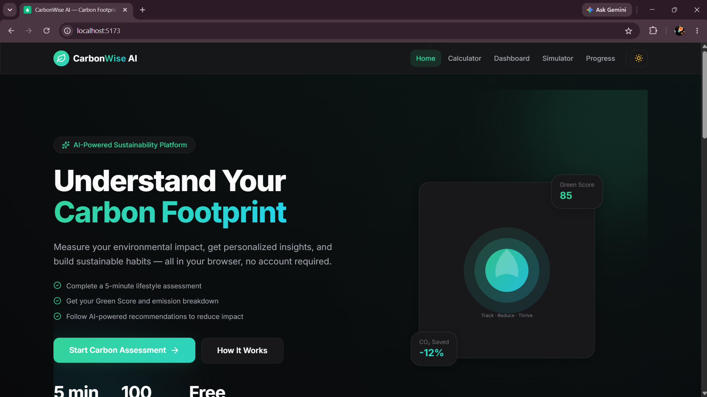
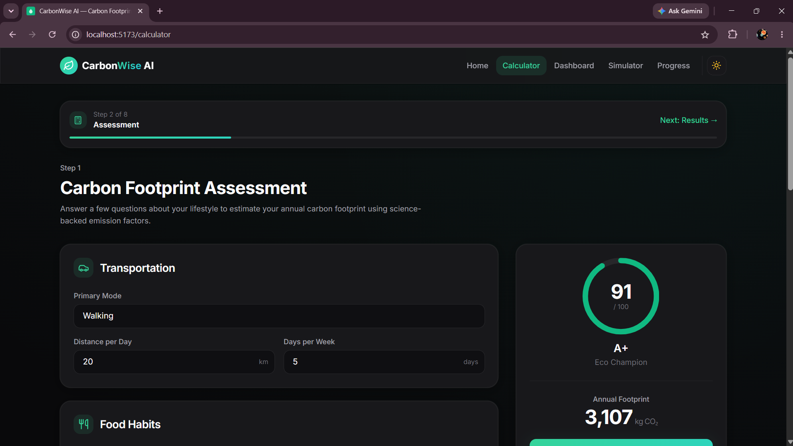
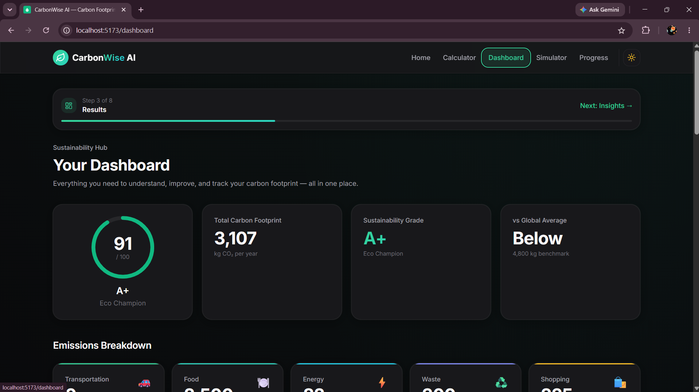
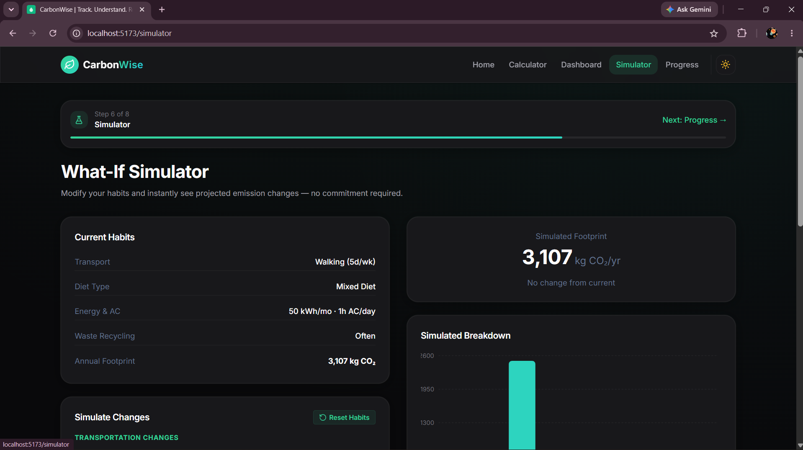
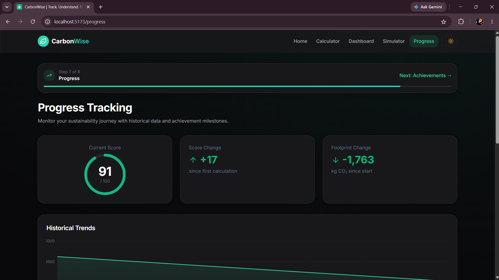

# 🌱 CarbonWise


> Helping individuals understand, track, and reduce their carbon footprint through personalized insights, simulations, and sustainability guidance.

---

# 📌 Problem Statement

Climate change is one of the most pressing global challenges. However, many individuals struggle to understand how their daily activities contribute to carbon emissions.

**CarbonWise** addresses this problem by providing an intuitive platform where users can:

* Calculate their carbon footprint
* Visualize emissions across categories
* Track sustainability progress
* Explore "what-if" scenarios
* Receive personalized recommendations
* Build environmentally conscious habits

---

# 🚀 Solution Overview

CarbonWise transforms complex sustainability metrics into actionable insights.

The platform analyzes a user's lifestyle across multiple categories and presents:

* Carbon footprint calculations
* Sustainability scoring
* Emission breakdowns
* Progress tracking
* Interactive simulations
* Personalized sustainability coaching

The goal is to help users make informed decisions that reduce environmental impact.

---

# ✨ Key Features

## Carbon Footprint Calculator

Calculate emissions from:

* Transportation
* Home Energy Usage
* Food Consumption
* Waste Management
* Shopping Habits

## Sustainability Dashboard

View:

* Green Score
* Emission Categories
* Sustainability Grade
* Recommendations
* Progress Metrics

## What-If Simulator

Experiment with lifestyle changes:

* Transportation methods
* Diet choices
* Electricity consumption
* AC usage
* Recycling habits
* Plastic usage

and instantly see the impact.

## Sustainability Coach

Provides personalized recommendations based on the user's footprint profile.

## Progress Tracking

Monitor sustainability improvements over time.

## Guided Sustainability Journey

An 8-step guided experience that helps users gradually improve their environmental habits.

## Accessibility Features

* Keyboard navigation
* Skip-to-content links
* Screen reader support
* Accessible chart summaries
* Semantic markup

## Dark & Light Mode

Fully responsive theme system designed for accessibility and usability.

---

# 📸 Screenshots

## Landing Page



## Calculator



## Dashboard



## Simulator



## Progress Tracking



---

# 🏗️ Architecture

```text
User Input
      │
      ▼
Carbon Calculator
      │
      ▼
Emission Analysis Engine
      │
      ├────────► Dashboard
      │
      ├────────► Sustainability Coach
      │
      ├────────► Progress Tracking
      │
      └────────► What-If Simulator
```

---

# ⚙️ Carbon Calculation Logic

CarbonWise calculates emissions using category-based emission factors derived from commonly accepted sustainability datasets and methodologies.

Categories:

| Category       | Factors Considered                      |
| -------------- | --------------------------------------- |
| Transportation | Distance, travel mode, travel frequency |
| Energy         | Electricity usage, AC usage             |
| Food           | Dietary habits                          |
| Waste          | Recycling frequency, waste generation   |
| Shopping       | Consumption behavior                    |

Results are aggregated into:

* Total Carbon Footprint
* Green Score
* Sustainability Grade

---

# 📊 Technology Stack

| Technology   | Purpose            |
| ------------ | ------------------ |
| React        | Frontend Framework |
| Vite         | Build Tool         |
| JavaScript   | Application Logic  |
| Tailwind CSS | Styling            |
| Context API  | State Management   |
| LocalStorage | Persistence        |
| Recharts     | Data Visualization |

---

# 📁 Project Structure

```text
src/
├── components/
│   ├── calculator/
│   ├── charts/
│   ├── dashboard/
│   ├── layout/
│   ├── progress/
│   ├── recommendations/
│   └── ui/
│
├── context/
├── hooks/
├── pages/
├── utils/
├── data/
└── assets/
```

---

# ♿ Accessibility

The project includes:

* Skip-to-content navigation
* Accessible chart summaries
* Screen reader support
* Keyboard-friendly interactions
* Form validation feedback
* Semantic HTML structure

---

# ⚡ Performance Optimizations

* Context separation to reduce unnecessary re-renders
* Memoized chart components
* Optimized state updates
* Debounced LocalStorage persistence
* Production Vite build optimization

---

# 🛠️ Installation

Clone the repository:

```bash
git clone <repository-url>
cd carbonwise-ai
```

Install dependencies:

```bash
npm install
```

Run development server:

```bash
npm run dev
```

---

# 📦 Build

Create a production build:

```bash
npm run build
```

Preview production build:

```bash
npm run preview
```

---

# 🌐 Deployment

The project can be deployed on:

* Vercel
* Netlify
* Firebase Hosting
* Cloud Run

Recommended:

```text
GitHub → Vercel → Automatic Deployments
```

---

# 🤖 AI Tools Used During Development

This project was developed using AI-assisted software engineering workflows.

## ChatGPT

Used for:

* Architecture planning
* UX reviews
* Accessibility guidance
* Feature prioritization
* Debugging assistance

## Cursor

Used for:

* React component generation
* Refactoring
* UI implementation

## Claude

Used for:

* Code reviews
* Architecture audits
* Quality assessment
* Improvement recommendations

## Gemini Code Assist

Used for:

* Development assistance
* Code suggestions
* Productivity improvements

## AntiGravity

Used for:

* Final optimization pass
* Accessibility enhancements
* Validation improvements
* UI polish

---

# 🧠 Prompt Engineering Workflow

Development followed an iterative AI-assisted workflow:

1. Problem analysis
2. Architecture design
3. Feature implementation
4. UX review
5. Accessibility review
6. Performance optimization
7. Final polish and testing

All AI-generated outputs were manually reviewed, validated, and refined before inclusion.

---

# 🎯 PromptWars Challenge Alignment

| Requirement                 | Implementation             |
| --------------------------- | -------------------------- |
| Understand Carbon Footprint | Calculator & Dashboard     |
| Track Carbon Footprint      | Progress Tracking          |
| Reduce Carbon Footprint     | Sustainability Coach       |
| Personalized Insights       | Recommendation Engine      |
| Practical Usability         | Responsive Design          |
| Accessibility               | WCAG-focused improvements  |
| Code Quality                | Modular React Architecture |

---

# 🧪 Testing & Validation

Completed:

* Input validation
* Route validation
* Mobile responsiveness checks
* Accessibility verification
* Production build verification
* Lint verification

---

# 🔮 Future Enhancements

* AI-generated sustainability reports
* Regional carbon emission factors
* Community challenges
* Carbon reduction goals
* Exportable sustainability reports
* Cloud synchronization

---

# 👨‍💻 Author

**Sarang Salunkhe**

PromptWars Virtual – Challenge 3 Submission

---

# 📄 License

This project was created for educational and competition purposes as part of PromptWars Virtual Challenge 3.
